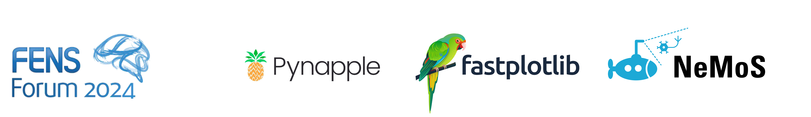

# Flatiron CCN workshop on neural data analysis

We are excited to see everyone at the Flatiron Center for Computational Neuroscience FENS Satellite event on using open source packages to analyze and visualize neural data! You should have received an email with logistical information, including the schedule and link to the slack channel where we will be communicating the workshop. If you did not receive this email, please let us know!

Over the course of this two-day workshop, we will walk you through the notebooks included on this site in order to demonstrate how to use pynapple, fastplotlib, and NeMoS to analyze and visualize your data.

Before the workshop, please try to follow the [setup](#setup) instructions below to install everything on your personal laptop. Additionally, if you are bringing your own data, please see the section on [converting your data to NWB](#converting-your-data-to-nwb).

The presentations for this workshop can be found [at this page](https://neurorse.flatironinstitute.org/workshops/fens-2024).

## This website

This website contains rendered versions of the notebooks we will be working through during this workshop. During the workshop, attendees should look at the versions found under [For users](generated/for_users). These notebooks have some code pre-filled, as well as brief notes to help orient you. If you follow the [setup](#setup) instructions below, you will have editable copies of these notebooks on your laptop, and you are expected to follow along using these notebooks.

If you miss something or lose progress, you can look into the [For presenters](generated/just_code) section, which includes the code blocks we will be writing during the exercise sections that you can then copy into your version.

After the workshop, we encourage you to return and check out the [Full tutorials](generated/gallery) section, which, as the name implies, includes everything: explanatory text, code, and plots.

## Setup

Before the workshop, please try to complete the following steps. If you are unable to do so, we will be in the hotel, Palais Saschen Coburg room IV, from 4 to 6pm on Saturday, June 22 to help. Please come by!

0. Make sure you have `git` installed. It is installed by default on most Mac and Linux machines, but you may need to install it if you are on Windows. [These instructions](https://github.com/git-guides/install-git) should help.
1. Clone the github repo for this workshop:
   ```shell
   git clone https://github.com/flatironinstitute/ccn-software-fens-2024.git
   ```
2. Create a new python 3.11 virtual environment. If you do not have a preferred way of managing your python virtual environments, we recommend [miniconda](https://docs.anaconda.com/free/miniconda/). After installing it (if you have not done so already), run 
    ```shell
    conda create --name fens2024 pip python=3.11
    ```
3. Activate your new environment: `
    ```shell
    conda activate fens2024
    ```
4. Navigate to the cloned github repo and install the required dependencies. This will install pynapple, fastplotlib, and nemos, as well as jupyter and several other packages.
    ```shell
    cd ccn-software-fens-2024
    pip install -e .
    ```
5. Run our setup script to download data and prepare the notebooks:
    ```shell
    python scripts/setup.py
    ```
6. Confirm the installation and setup completed correctly by running:
    ```shell
    python scripts/check_setup.py
    ```
7. Confirm the installation of `fastplotlib` and associated libraries worked by running `jupyter lab`, opening up `notebooks/test_fastplotlib_installation.ipynb` and ensuring that you can run the notebook to completion without any errors.


If `check_setup.py` tells you setup was successful, then you're good to go. Otherwise, please come to the installation help session in the hotel, Palais Saschen Coburg room IV, on Saturday, so everyone is ready to get started Sunday morning.

!!! warning "Could not find `wgpu` binary"
    If the `checks_setup.py` fails because it could not find the `wpu` binary, you may need to install `wgpu-py`
     from conda. These are the steps:

    1. Make sure that you have `conda-forge` in your channels.
       ```shell
       conda config --add channels conda-forge
       conda config --set channel_priority strict
       ```
    2. Install `wgpu-py` through conda.
       ```shell
       conda install wgpu-py
       ```

After doing the above, the `data/` and `notebooks/` directories within your local copy of the `ccn-software-fens-2024` repository will contain the NWB files and jupyter notebooks for the workshop.

We will work through the notebooks in the order they're listed on this website. On your machine, you should see that all notebooks start with a zero-padded number (e.g., `01`, `02`); this is the order we'll work through them.

## Converting your data to NWB

If you plan to bring your own data to the Monday afternoon session, please convert it to the [NWB format](https://pynwb.readthedocs.io/). It will make it much easier to load it with pynapple. We recommend the following tools to convert : [NeuroConv](https://neuroconv.readthedocs.io/en/main/) or [NWBGuide](https://nwb-guide.readthedocs.io/en/latest/). If you have any questions about NWB, please consider asking them on the [NWB Helpdesk](https://github.com/NeurodataWithoutBorders/helpdesk/discussions).

## Binder

If you are unable to get the [local install](#setup) working, or run into unforeseen issues during the workshop, we have also set up two binder instances you can use. For both, you will need to login with a google account in order to access the instance, and that account should be the email that you used when submitting your application. If you get a 403 Forbidden error or would like to use a different email account, send Billy Broderick a message on the workshop slack.

The instances are:
- [for the fastplotlib notebooks](https://binder.flatironinstitute.org/~kkolar/fpl)
- [for the other notebooks](https://binder.flatironinstitute.org/~wbroderick/fens2024)

Some usage notes:

- You are only allowed to have a single binder instance running at a time, so if you get the "already have an instance running error", go to the [binderhub page](https://binder.flatironinstitute.org/hub/hub/home) (or click on "check your currently running servers" on the right of the page) to join your running instance.
- If you lose connection halfway through the workshop, go to the [binderhub page](https://binder.flatironinstitute.org/hub/hub/home) to join your running instance rather than restarting the image.
- This is important because if you restart the image, **you will lose all data and progress**. If this happens, see [this page](https://flatironinstitute.github.io/ccn-software-fens-2024/generated/just_code/) for notebooks that have the code to copy.
- The binder will be shutdown automatically after 1 day of inactivity or 7 days of total usage. Data will not persist after the binder instance shuts down, so **please download any notebooks** you want to keep.
